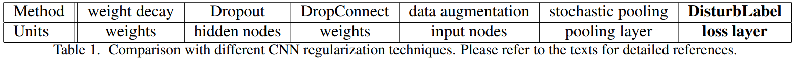

# DisturbLabel-PyTorch
PyTorch implementation of [DisturbLabel: Regularizing CNN on the Loss Layer](https://arxiv.org/abs/1605.00055) [CVPR 2016]

## DisturbLabel introduction:
The authors propose adding label noise deliberately to improve the generalization of image classification algorithms. They claim it is the first attempt at regularizing the network at **loss layer**, unlike other methods:

Based on Multinoulli distribution, the DisturbLabel algorithm changes a small portion of the mini-batch labels regardless of the ground-truth labels

$$
f(x) = 2x^2
$$
